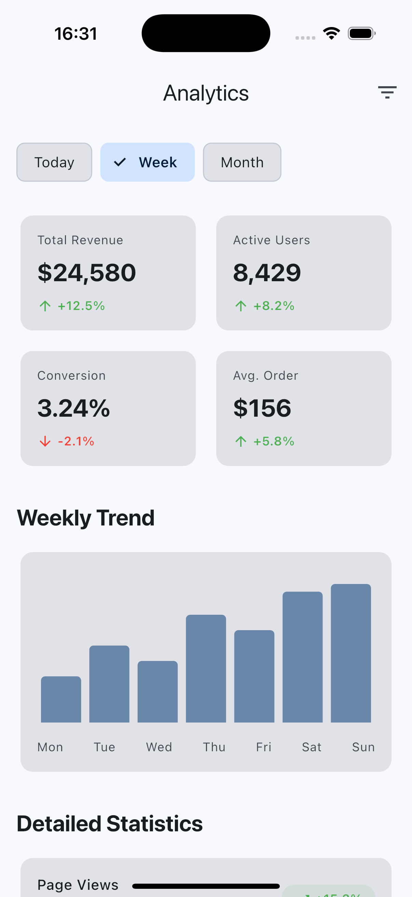
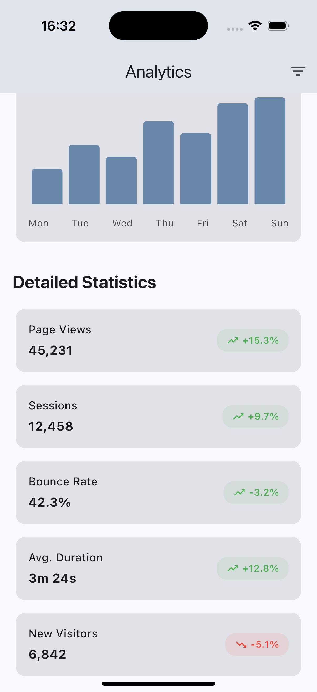

# Flutter Statistics Screen (Material 3)

A clean, production-ready statistics screen for Flutter apps.

This template focuses on clarity, spacing, and real-world usability.
No navigation, no state management, no boilerplate.

Full template available on Gumroad:  
👉 https://griseo.gumroad.com/l/dev-flutter-statistics-screen

## Features
- Material 3 design
- Metric cards
- Progress and percentage indicators
- Clean layout and typography
- Easy to adapt to real data

## Tech Stack
- Flutter (stable)
- Material 3
- No external dependencies

## Screenshots

## Usage
1. Copy the screen file into your project
2. Adjust colors, text, and values
3. Connect your own data source

## Use Cases
- Analytics dashboards
- Statistics and KPI screens
- MVPs and prototypes
- Internal tools

This template is part of a larger Flutter UI template collection.
